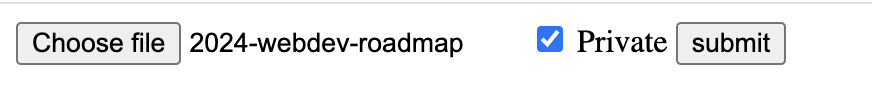
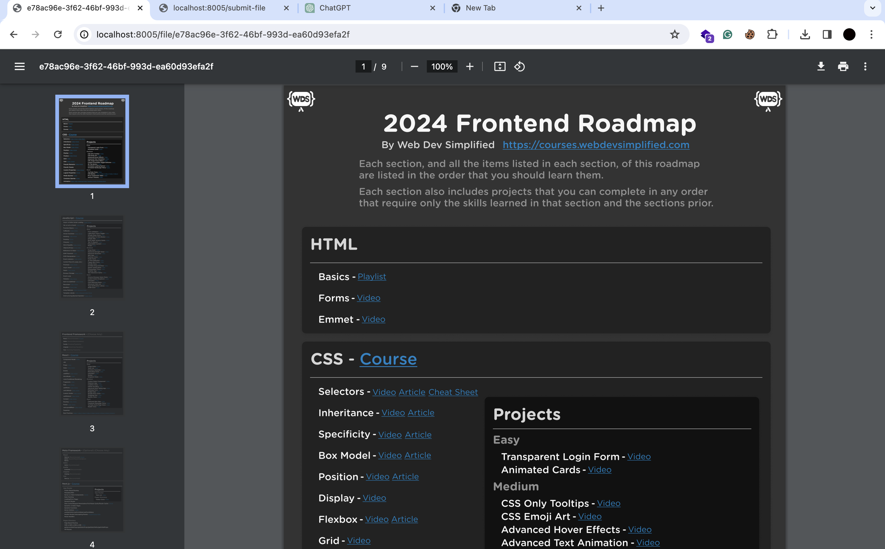
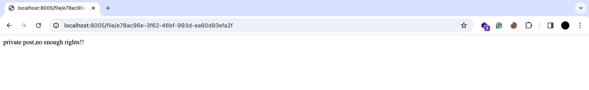

# File Sharing Backend

This Node.js backend application provides file sharing capabilities using Multer for file uploads, JWT for authentication, and features for private/public file sharing with short URLs.

## Features

- **File Uploads:** Allows users to upload files to the server.
- **JWT Authentication:** Secure authentication using JSON Web Tokens (JWT).
- **Private/Public File Sharing:** Users can mark files as private (only accessible to the owner) or public (accessible to anyone with the link).
- **Short URLs:** Automatically generates short URLs for public files for easy sharing.
- **File Access Control:** Ensures that private files are only accessible to the owner.

## Tech Stack

- Node.js: Backend environment for server-side JavaScript.
- Express: Web framework for Node.js.
- Multer: Middleware for handling file uploads.
- JWT: JSON Web Tokens for authentication.
- MongoDB: Database for storing file metadata and user information.
